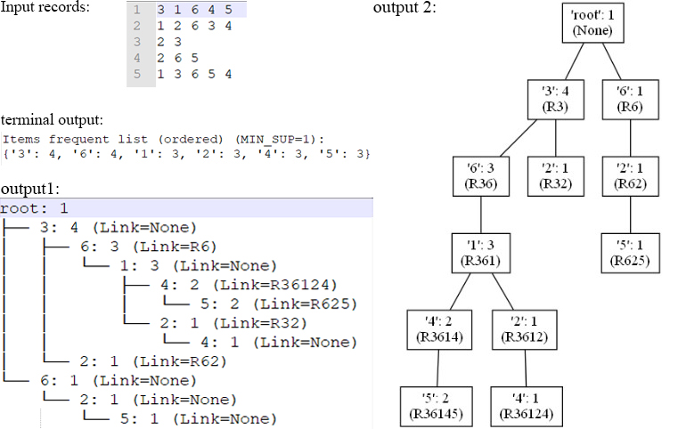

# FP-Growth Tree

Generate FP-Growth Tree of a dataset with visualized graph output.

* Each record of the dataset consists of numbers between 0 to 9 as items.

* Minimum Support is set in `main` function.

* Python>=3.7.

----------------------

### Example:

